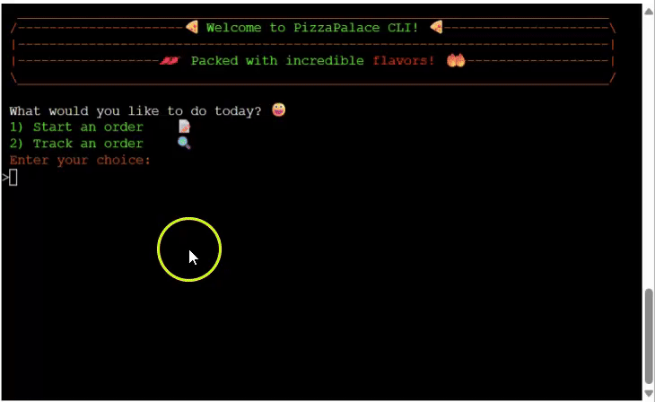
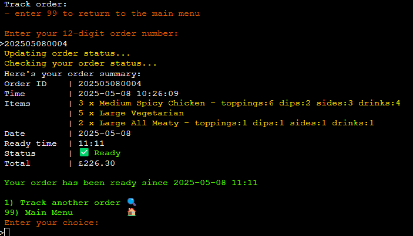

# PizzaPalace CLI

**Authors:** Tumelo Maja (GitHub username: tumelo-maja)

PizzaPalace is a command-line_interface (CLI) application for ordering pizza meals. User can choose their desired pizza and add additional toppings and dips. User are able to include drinks and sides in the meal order. 

**The application is aimed at helping users to:** 
  - Place an order for pizza meal in the command terminal
  - Modify their pizza order by adding extra toppings and dips
  - Add drinks and sides to their meal order
  - Track their placed order to know when/if their order is ready

**Target audience:** 
  - Individuals looking to buy pizza
  - Event organisers/companies looking to place large order purchases of pizza
  - 

**Application Mockup:** 
  <figure>
    
     
    <figcaption><strong><em>Pizza Palace: Full order placement</em></strong></figcaption>
  </figure>

## Features 

### Existing Features
- **Main menu**
  <figure>
    
     
    <figcaption><strong><em>Main Menu</em></strong></figcaption>
  </figure>

  - **1)** - Start making an order.
  - **2)** - Start tracking an order.
  - **Enter your choice:** - Enter a single digit followed by Enter

- **Choose pizza name**
  <figure>
    
     
    <figcaption><strong><em>Choose Pizza Name</em></strong></figcaption>
  </figure>

  - **Options** - select from 5 options showing names and base toppings for each pizza.
  - **Enter your choice:** - Enter a single digit followed by Enter
  - **Limits** - input must be an integeter betweeen 1 and 5 or enter 99 to return to 'Main Menu'

- **Choose pizza size**
  <figure>
    
     
    <figcaption><strong><em>Choose Pizza Size</em></strong></figcaption>
  </figure>

  - **Options** - select from 3 options showing size and price for each option.
  - **Enter your choice:** - Enter a single digit followed by Enter
  - **Limits** - input must be an integeter betweeen 1 and 3 or enter 99 to return to 'Main Menu'

- **Choose extra toppings**
  <figure>
    
     
    <figcaption><strong><em>Choose Extra Toppings (optional)</em></strong></figcaption>
  </figure>

  - **Options** - select '0 - None' to not include any topping, 1 or more options as displayed with their prices.
  - **Limits:**
    - input(s) must be integers betweeen 0 and 8 or enter 99 to return to 'Main Menu'
    - Multiple options may be selected and any option can be repeated
    - A maximum of 8 extra toppings items may be selected per meal.

- **Choose extra dips**
  <figure>
    
     
    <figcaption><strong><em>Choose Extra Dips (optional)</em></strong></figcaption>
  </figure>

  - **Options** - select '0 - None' to not include any dip, 1 or more options as displayed with their prices.
  - **Limits:**
    - input(s) must be integers betweeen 0 and 4 or enter 99 to return to 'Main Menu'
    - Multiple options may be selected and any option can be repeated.
    - A maximum of 4 extra dips may be selected per meal.

- **Choose sides**
  <figure>
    
     
    <figcaption><strong><em>Choose Sides (optional)</em></strong></figcaption>
  </figure>

  - **Options** - select '0 - None' to not include any side, 1 or more options as displayed with their prices.
  - **Limits:**
    - input(s) must be integers betweeen 0 and 6 or enter 99 to return to 'Main Menu'
    - Multiple options may be selected and any option can be repeated.
    - A maximum of 6 sides may be selected per meal.

- **Choose drinks**
  <figure>
    
     
    <figcaption><strong><em>Choose Drinks (optional)</em></strong></figcaption>
  </figure>

  - **Options** - select '0 - None' to not include any drinks, 1 or more options as displayed with their prices.
  - **Limits:**
    - input(s) must be integers betweeen 0 and 8 or enter 99 to return to 'Main Menu'
    - Multiple options may be selected and any option can be repeated.
    - A maximum of 8 drinks may be selected per meal.

- **Specify meal quantities**
  <figure>
    
     
    <figcaption><strong><em>Specify Meal Quantities</em></strong></figcaption>
  </figure>

  - **Options** - Specify number of quantities to order for the current meal.
  - **Limits:**
    - input must be number betweeen 1 and 50 or enter 99 to return to 'Main Menu'
    - A maximum of 50 meals may be ordered for each meal.

- **Meal summary**
  <figure>
    
     
    <figcaption><strong><em>Meal Summary</em></strong></figcaption>
  </figure>

  - **Meal display** - complete meal summary is shown including any extra items selected and their quantities per meal.
  - **1) Yes** - to add another meal; app goes back to choose pizza name.
  - **2) No** - to proceed to checkout; app goes to order summary.
  - **Limits:** input must be an integer betweeen 1 and 2 or enter 99 to return to 'Main Menu'

- **Order summary - add meals**
  <figure>
     
    
     
    <figcaption><strong><em>Order Summary - Add more meals</em></strong></figcaption>
    *Note: bottom image shows mutliple meal added by selecting option 2.
  </figure>

  - **Meal display** - complete order summary is shown including any extra items selected and their quantities for each meal.
  - **1) Place Order** - to submit the order.
  - **2) Add more meals** - to add 1 or more meals to the order; app goes back to choose pizza name
  - **3) Remove meals** - to remove 1 or more meals from the order; app goes to remove meals menu.
  - **Limits:** input must be an integer betweeen 1 and 3 or enter 99 to return to 'Main Menu'

- **Order summary - remove meals**
  <figure>
    
     
    Option 3 selected
     
    
     
    Meal options 5,3 and 4 were selected to be removed
     
    <figcaption><strong><em>Order Summary - Remove meals</em></strong></figcaption>
  </figure>

  - **Meal display** - complete order summary is shown including any extra items selected and their quantities for each meal.
  - **1) Place Order** - to submit the order.
  - **2) Add more meals** - to add 1 or more meals to the order; app goes back to choose pizza name
  - **3) Remove meals** - to remove 1 or more meals from the order; app goes to remove meals menu.
  - **Limits:** input must be an integer betweeen 1 and 3 or enter 99 to return to 'Main Menu'

- **Order summary - submit order**
  <figure>
    
     
    option 1 selected to submit an order.
     
    
     
    Order submission feedback - success!
     
    <figcaption><strong><em>Order Summary - Submit</em></strong></figcaption>
  </figure>

  - **Order summary** - complete order summary is displayed after submission with order number and ready time.
  - **Press Enter** - to return to Main Menue.

- **Main Menu - Track Order**
  <figure>
    
     
    Option 2 selected ie. Track an order
     
    
     
    Valid order output
     
    <figcaption><strong><em>Main Menu - Track Order</em></strong></figcaption>
    *Note: bottom image shows ouput from a valid order number.
  </figure>

  - **Order Status** - complete order summary is shown including the status of the order; could either be 'Ready' or 'Preparing'.
  - **1) Track another order** - to track another order; app return to track order and prompts user to enter new order number.
  - **Limits:** input must be 12-digit number or enter 99 to return to 'Main Menu'

- **Track Order - Invalid Entries**
  <figure>
    
     
    * valid order number format but order number does not exist
    * Invalid order number format
    Valid order output
     
    <figcaption><strong><em>Track Order - Invalid Entries</em></strong></figcaption>
  </figure>

  - **Order number not found** - an order number that does not exist in the order records.
  - **Invalid order number format** - an order number with an invalid format.
  - **Limits:** input must be 12-digit number or enter 99 to return to 'Main Menu'

### Features Left to Implement

- Menu to record collected pizzas and have a 'collected' as one of the statuses
- Future releases should use a proper database. Currently only order summaries are saved to the google sheet. The specific items are not saved i.e. google sheet has only number of drinks and not exactly which drink type e.g Orange Juice.

## Project planning
In this section, we provide all tasks related to project planning for development of the application. User stories and business goals are presented in this section

### Key business goals
Primary goal: Design an interactive, user-friendly and efficient pizza ordering application that gives a positive user experience to all users.

Other goals:
- Increase pizza order traffic
- Enhance user experience with intuitive application flow and informative feedback.
- Provide users with the option to customise their meal order by adding extras on the pizza and or sides and drinks 

### User stories

- **Interactive Welcome Message (must-have)**

  **Story:** 
    - As a user, I want to be welcomed by a user-friendly welcome message with clear and intuitive information about how to use the application.

  **Acceptance Criteria:**
    - On load, the application displays application name and welcome message.
    - The user is presented with two options 1) Place an order and 2) Track an order
    - User input is validated and any invalid entries are handle with an informative feedback and guide to resolve them

  **Tasks:**
    - Implement welcome display to run on launch of the application
    - Display two option with clear labels and corrensponding integer to enter for each option
    - Add code to validate user input and provide feeback for invalid entries while allowing user to resubmit the correct input

- **Add Pizza to Order (must-have)**

  **Story:** 
    - As a user, I want to see the available pizza options,prices, sizes and extras so I can choose and customize the pizza with my desired toppings.

  **Acceptance Criteria:**
    - Users can select pizza type using a integer input displayed besides each pizza option.
    - Users can choose pizza size from the 3 standard size options
    - Users have the option of adding extra toppings to their pizza,comma-separated integers - up to 8 toppings can be added.
    - Users have the option of adding extra dips to their pizza,comma-separated integers - up to 4 dips can be added.
    - User input is validated and any invalid entries are handle with an informative feedback and guide to resolve them

  **Tasks:**
    - Display pizza names and for each pizza, display base toppings included
    - After pizza name selection, display pizza sizes and cost for each option.
    - After pizza size selection, display optional extra topping avaibale to the user showing maximum amount allowed. 
    - After extra toppings selection, display optional extra dips avaibale to the user showing maximum amount allowed. 
    - Add code to validate user input and provide feeback for invalid entries while allowing user to resubmit the correct input

- **Submit Order to Google Sheets (must-have)**

  **Story:** 
    - As a user, I want to review and submit my order; view its summary and the time it will be ready by.

  **Acceptance Criteria:**
    - Order summary is displayed after all selections have been made
    - On confirmation, user can submit their order and receive success feeback and expected ready time.
    - Order summary is displayed including generated order number, counts of items ordered and total cost
    - User input is validated and any invalid entries are handle with an informative feedback and guide to resolve them

  **Tasks:**
    - Add code to connect to google sheets to add new order
    - Display order summary including ordered items, total costs and cacalculated ready by time
    - Display generated order number to be used for tracking the order. Prompt user return to home page. 
    - Add code to validate user input and provide feeback for invalid entries while allowing user to resubmit the correct input

- **Track Existing Order (must-have)**

  **Story:** 
    - As a user, I want to track my existing order using a unique order number so i can see its status.

  **Acceptance Criteria:**
    - Track order status can be accessed from main menu by selecting option 2
    - User is prompted to enter a valid order number.
    - If order exists, a full summary of the order is displayed including the order status otherwise user is informed if order number does not exist
    - User input is validated and any invalid entries are handle with an informative feedback and guide to resolve them

  **Tasks:**
    - Add code to refresh the google sheets to update order statuses
    - Add code to search for the valid order number from the google sheets records
    - Add code to display the order summary if order number exists in the records. Prompt user return to home page. 

- **Multiple Meals Order (should-have)**

  **Story:** 
    - As an event organizer, I want to add mutliple pizzas to order so I can place a full order for my group events.

  **Acceptance Criteria:**
    - After all meal selection and before submitting order, user is asked if they want to add another meal to the current order
    - User can specify pizza quantities for each meal item, up to 50 pizzas can be order per meal.
    - Final summary displays all pizzas with their individual selections of extras, drinks or sides
    - User input is validated and any invalid entries are handle with an informative feedback and guide to resolve them

  **Tasks:**
    - Implement code to allow user to add more meals to a single order
    - Implement code to allow user specify meal quantities for a specific meal before finlaizing the order item.
    - Using Order class, all meal items can be stored as a list with their individual selections
    - Add code to account for preparation time for large orders
    - Add code to validate user input and provide feeback for invalid entries while allowing user to resubmit the correct input

- **Add Meal Extras: Wings and Fries (should-have)**

  **Story:** 
    - As a user, I want to see the available sides and their prices so I can include them when I order the pizza should I choose to.

  **Acceptance Criteria:**
    - After completing pizza selection, display optional sides (wings/fries) available to the users to include in the meal order.
    - Users can choose different from sizes for the wings or fries sides,comma-separated integers - up to 6 sides can be added to the order.
    - User input is validated and any invalid entries are handle with an informative feedback and guide to resolve them

  **Tasks:**
    - Display a list of avaliable sides, their prices, sizes and corresponding integers to be used for selecting one or more sides.
    - Ensure that user's input does not exceed  the maximum number of sides allowed per meal.
    - Add code to validate user input and provide feeback for invalid entries while allowing user to resubmit the correct input

- **Add Drinks (should-have)**

  **Story:** 
    - As a user, I want to see the available drinks and their prices so I can include them when I order my meal.

  **Acceptance Criteria:**
    - After completing sides selection, display available optional drinks and their prices to the users to include in the meal order if they choose to.
    - Users can choose different drinks offer,comma-separated integers - up to 8 drinks can be added to the order.
    - User input is validated and any invalid entries are handle with an informative feedback and guide to resolve them

  **Tasks:**
    - Display a list of avaliable drinks, their prices, sizes and corresponding integers to be used for selecting one or more sides.
    - Ensure that user's input does not exceed  the maximum number of drinks allowed per meal.
    - Add code to validate user input and provide feeback for invalid entries while allowing user to resubmit the correct input

- **Modify Order Before Submitting (could-have)**

  **Story:** 
    - As a user, I want to modify my order before submitting it so I can replace menu items and add new ones if my preferences change.

  **Acceptance Criteria:**
    - User add more items or remove items for the current order.
    - Order summary and total costs are updated to reflect the changes
    - User input is validated and any invalid entries are handle with an informative feedback and guide to resolve them

  **Tasks:**
    - Display options for adding or removing items and the corresponding functions to handle either action.
    - Update the Orders list and the calculated total costs
    - Add code to validate user input and provide feeback for invalid entries while allowing user to resubmit the correct input

- **Style CLI with Emojis and Text Colors (could-have)**

  **Story:** 
    - As a user, I want the application to include colored text and emojis so the outlook feels more welcoming and easier to read important text

  **Acceptance Criteria:**
    - Where applicable, emojis are used to match the text and highlight important information
    - Colored text is used .e.g red color for errors and green for success
    - Styled text improves readability without distracting the user

  **Tasks:**
    - Implement text styling and coloring using relevant libraries
    - Implement emoji using unicode and where necessary 
    - Adjust text alignment to achieve consistency in text styling 

- **Anytime Application Exit (could-have)**

  **Story:** 
    - As a user, I want to abondon current order and return to main menu so I can start a new order without having to delete all individual order items

  **Acceptance Criteria:**
    - At every display, user can enter '99' to return to main menu
    - Order instance is reset and all previously added order items are cleared. 

  **Tasks:**
    - Add 'main menu' option to all inputs fields groups throughout the application
    - Warn user and seek confirmation to prevent accidental order deletion

### Flow charts

## Google Sheets API
This application uses google sheets as a cloud storage for placed orders. Google sheets and google drive APIs have been enabled for the application to have read and write permissions in the spreadsheet. A private API key is used to securely access the orders records and to update data in the sheet. 

  <figure>
    
    <figcaption><strong><em>Google Sheets - 'Orders' worksheet</em></strong></figcaption>
  </figure>

### Variables stored in Google sheets

- **Order ID**: A unique identifier based on the date and sequence number.
    
- **Order Date & Time**: Date timestamp when the order was placed.

- **Order Items**: Summary of pizzas, toppings, sides, drinks, and quantities.

- **Ready Time**: Calculated order completion time.

- **Status**: Indicates order status, the string can either be 'Preparing' or 'Ready'.

- **Total Cost**: Total amount for the order.

### Sheet updates and record retrivals
The application can add new records (as rows) to the 'orders' worksheet and also retrieve all records for tracking an existing order.

- **Sheet Updates:**
    - When an order is submitted from the application, a new row is added to the 'orders' worksheet.

    - The row includes all key order information: date, items, price, status, and readiness time in line with columns names in the worksheet.

- **Record Retrievals:**
    - When tracking an order, the application fetches all records and locates a specific order by checking the user's input order number against all existing entries in the 'order number' column of the worksheet.

    - The order statuses are updated based on the current time versus the scheduled ready time.

    - The updated summary of the queried order will be displayed in the application if it exists.

## Technologies

- **Python** - The application was developed using Python as the main language.
    - Packages used in the app include: gspread, google-auth, collections, datetime, pandas, os, re, pytz and two custom modules (pizza_meals and menu_items)
- **Google Sheets** - Orders records were stored on google sheets and an API with secure credentials was used access and modify the worksheet.

## Testing 
### Feature Testing
#### 1) **Full Meal Order**
| Step | Display Screen              | User input | Expected Outcome                            | Actual Outcome     | Result |
|----  |-----------------            |------      |-----------------                            |------------------- |------- |
| 1    | Main Menu*                   | 1          | Main Menu screen displays with 2 option prompt, option 1 selected  | Main Menu screen displays with 2-option prompt correctly, option 1 selected  |  Pass |
| 2    | Choose Pizza Name*           | 1          | 5 x pizza name options with base toppings displayed, option 1 selected       | 5 x pizza options with base toppings are displayed correctly, option 1 selected   |  Pass |
| 3    | Choose Pizza Size*           | 1          | 3 x pizza size options with prices displayed | 3 x pizza sizes displayed with prices, option 1 selected       |  Pass |
| 4    | Choose Extra Toppings**       | 1,3,4      | 8 x extra toppping options with prices displayed, 3 x toppings selected | 8 x extra toppping options with prices, options 1,3,4 selected  |  Pass |
| 5    | Choose Extra Dips**           | 1,2        | 8 x extra toppping options with prices displayed, 2 x dips selected | Dip options shown with prices, options 1,2 selected  |  Pass |
| 6    | Choose Sides**                | 1,4        | 6 x sides options with prices displayed, 2 x sides selected | Sides options shown with prices, options 1,4 selected |  Pass |
| 7    | Choose Drinks**               | 2,3,8      | 8 x drinks options with prices displayed, 3 x drinks selected | Drink menu shown with prices; options 2,3,8 selected      |  Pass |
| 8    | Enter Meal Quantity*         | 10         | dsiplay of prompt to specify quantity between 1 and 50 units  | Input prompt and validation passes. 10 meals specified |  Pass |
| 9    | Meal Summary Display*;   Add Another Meal Prompt | 2 | Meal summary displayed including pizza name and side, extra toppings and sides, sides and drinks qunatities are displayed for each meal item;  Prompt display to add another meal (Yes/No) - option 2 (No) selected | Full meal summary displayed including pizza options selected, extras, sides and drinks;  Prompt display to add another meal - option 2 selected to proceed to order summary |  Pass |
| 10   | Full Order Summary display*;   Prompt with options to submit/modify Order items  | 1   | Full order summary displayed showing all meals, their quantities, subtotal prices for each meal and total order price;   Prompt with options to submit, add or remove meal items from the order - Option 1 to submit order selected  | Full order description with all meals and the total cost displayed;  Prompt with options to submit, add or remove meal items from the order - Option 1 to submit order selected |  Pass |
| 11   | Submission confirmation* - Order details display Return to Menu Prompt   | *Enter*  | Confirms submission and sends order to Google sheets;   Order details display including order number and ready time - prompt to return to main menu | Confirmation message and display of order details including  order numbe  and ready time. Order status shown as 'Preperaing'  Prompt to return to main menu - Enter pressed and user is brought to main menu |  Pass |

***Note:***
- *Single entry - Exactly 1 number is required as an input. 
- *Multiple entry - 1 or more numbers can be entered as input; multiple values should be comma-separated. 
  

#### 2) **Full Order Track**
| Step | Display Screen              | User input | Expected Outcome                            | Actual Outcome     | Result |
|----  |-----------------            |------      |-----------------                            |------------------- |------- |
| 1    | Main Menu*                   | 1          | Main Menu screen displays with 2 option prompt, option 1 selected  | Main Menu screen displays with 2-option prompt correctly, option 2 selected  |  Pass |
| 2    | Enter Order Number Display*         | 202505080008 | Order details revtrieved from Google Sheet 'orders' worksheet | Order details revtrieved from Google Sheet 'orders' worksheet |  Pass |
| 3    | Order Details Display*  Prompt display to track another order/return to main menu  | 1  | Order summary details are displayed including status with a value of "Ready" based on current time vs ready time | Order summary details are displayed including status with a value of "Ready" based on current time vs ready time |  Pass |
| 4    | Option 1) Track Another Order  | 1 | Display of prompts enter another order number | Option to enter another number or return home displayed                    |  Pass |
| 5    | Option 99) Main Menu  | 99 | USer is returned to the main menu | USer is returned to the main menu  |  Pass |
| 6    | Any other entry besides 1 or 99 - Error handling:  Order Not Found | 202401010001 | Displays error message:  "Order number 202401010001 not found. Please check the number and try again."  Prompt to re-enter order number is displayed| Displays error message:  "Order number 202401010001 not found. Please check the number and try again."  Prompt to re-enter order number is displayed  |  Pass |
| 7    | 'Enter your 12-digit order number' - Error handling:  Invalid Order Number Format | 9999               | Displays error message  "Invalid entry: '9999' is not a valid order number. Order number must start with '20', please try again"   Prompt to re-enter order number is displayed | Displays error message:  "'9999' is not a valid order number. Order number must start with '20', please try again"  Prompt to re-enter order number is displayed  |  Pass |
| 8    | 'Enter your 12-digit order number' - Error handling:  Invalid Order Number Length | 202501               | Displays error message:  "Invalid entry: Order number must have exactly 12 integers - you privided 6, please try again"   Prompt to re-enter order number is displayed | Displays error message:  "Invalid entry: Order number must have exactly 12 integers - you privided 6, please try again"  Prompt to re-enter order number is displayed  |  Pass |

#### 3) **Error handling - Invalid entries**
| Input Type  | Invalid Entry Type     | User input | Expected Outcome     | Actual Outcome     | Result |
|----         |-----------------       |------      |-----------------     |------------------- |------- |
| Single      | Non-digit input        | One | Displays error message:  "Invalid entry: 'One' is not an integer, please try again."  Prompt to re-enter answer is displayed  | Displays error message:  "Invalid entry: 'One' is not an integer, please try again."  Prompt to re-enter answer is displayed  |  Pass |
| Single      | Empty input        | (no input entered) | Displays error message:  "Invalid entry: '' is not an integer, please try again."  Prompt to re-enter answer is displayed  | Displays error message:  "Invalid entry: '' is not an integer, please try again."  Prompt to re-enter answer is displayed  |  Pass |
| Single      | Out-of-range value     | 7         | Displays error message:  "Invalid entry: Value '7' is out of range. The input value must be between 1 and 5, please try again."  Prompt to re-enter answer is displayed  | Displays error message:  "Invalid entry: Value '7' is out of range. The input value must be between 1 and 5, please try again."  Prompt to re-enter answer is displayed  |  Pass |
| Mutliple    | Out-of-range value     | 1,2,9     | Displays error message:  "Invalid entry: Value '9' is out of range. The input values must be integers between 0 and 8, please try again."  Prompt to re-enter answer is displayed  | Displays error message:  "Invalid entry: Value '9' is out of range. The input values must be integers between 0 and 8, please try again."  Prompt to re-enter answer is displayed  |  Pass |
| Mutliple  | Entering '0' with other entries | 0,1,2 | Displays error message:  "Invalid entry: '0,1,2' is not a valid entry. You cannot select '0' with any other values, please try again."  Prompt to re-enter answer is displayed  | Displays error message:  "Invalid entry: '0,1,2' is not a valid entry. You cannot select '0' with any other values, please try again."  Prompt to re-enter answer is displayed  |  Pass |
| Mutliple  | Exceeding maxium entries allowed | 1,2,3,4,5,6,7,8,1,2,3 | Displays error message:  "Invalid entry: You've entered 11 items, you may only enter up to 8 items, please try again."  Prompt to re-enter answer is displayed  | Displays error message:  "Invalid entry: You've entered 11 items, you may only enter up to 8 items, please try again."  Prompt to re-enter answer is displayed  |  Pass |
| Mutliple  | Duplicate entries  (if repeats are not allowed) | 2,3,3 | Displays error message:  "Invalid entry: '2,3,3' is not a valid entry. Duplicate entries are not allowed, please try again."  Prompt to re-enter answer is displayed  | Displays error message:  "Invalid entry: '2,3,3' is not a valid entry. Duplicate entries are not allowed, please try again."  Prompt to re-enter answer is displayed  |  Pass |
| Mutliple      | Non-digit input(s)        | 1,2,a,5 | Displays error message:  "Invalid entry: 'a' is not an integer. The input values must be integers between 0 and 8, please try again."  Prompt to re-enter answer is displayed  | Displays error message:  "Invalid entry: 'One' is not an integer. The input values must be integers between 0 and 8, please try again."  Prompt to re-enter answer is displayed  |  Pass |
| Mutliple      | Invalid delimters  | 1,2;3/4&7.5 | Displays error message:  "Invalid entry: '1,2;3/4&7.5' is not a valid entry. ';', '/', '&', '.' delimiter(s) not allowed. Use comma ',' to separate the values, please try again."  Prompt to re-enter answer is displayed  | Displays error message:  "Invalid entry: '1,2;3/4&7.5' is not a valid entry. ';', '/', '&', '.' delimiter(s) not allowed. Use comma ',' to separate the values, please try again."  Prompt to re-enter answer is displayed  |  Pass |

### Code validation

### Bugs

## Deployment

### Google Sheets Setup
These are the steps to follow when setting up google sheet for API access:
- Sign-up for a google account or sign in if you already have one. 
- Go to the Google console website (<a href="https://console.cloud.google.com/" target="_blank" rel="noopener">link</a>) 
- On the platform, click on the 'Select a project' then click 'New Project'
- Add a project name and click 'Create'
- Ensure the newly created project has been selected and is the currently active project
- Click on the hanburger icon on the top left to display the navigation menu
- Under 'PRODUCTS' find and hover on 'APIs and services' then click 'Library' 
- In the search bar, search for  and select 'Google Drive API':.
  - Click 'Enable' to launch API overview page
  - Click on 'Create Credentials' button, under 'Credential Type' select 'Application data' then 'Next'
  - In the 'Create service account' window, enter service account name (e.g. robert) then 'Create and Continue'
  - Under 'Grant thise service account acces to project', Select the role of 'Editor' the 'Continue' >> 'Done'
  - Click 'Keys' from the tabs and select 'Add key' then 'Create new key'
  - Ensure JOSN option is selected on the pop up window the click 'Create' (.json file will be downloaded automatically)
- Back in the 'APIs and services' >> 'Library', search for 'Google Sheets API'
- Click on 'Enable' to activate
- Go to Google Sheets (<a href="https://docs.google.com/spreadsheets/u/0/" target="_blank" rel="noopener">link</a>) and create a blank Spreadsheet.
- In the first row, column names can be added: 'Order ID','Order date','Order items', 'Order ready time', 'Order status' and 'Order total'
- Click on 'Share' button (could be top right next tou account icon)
- Share access with the service account email (e.g. robert@**.iam.gserviceaccount.com) you created and set Role as 'Editor'

### Heroku Deployment

This section provides the steps to follow when deploying the project to Heroku. The steps to deploy are as follows: 
  - On the Heroku dashboard, click 'Create new app'
  - Speficy name for the app (e.g. pizza-order-cli, name must be unique) and select the region, then click 'Create app'
  - Got to the 'Settings' tab and scroll to the 'Config Vars' section and add the following:
    - Add the google sheets API credentials: KEY as 'CREDS' and VALUE as the content of the API credential JSON file.
    - Add Port 8000: KEY as 'PORT' and VALUE AS 8000
  - Navigate to Buildpacks and add buildpacks for Python and NodeJS (may need to click save each time you add a buildback. NB: they must be added in this specific order).
  - Go to the 'Deploy' tab, select GitHub as the delployment method
  - Click 'Connect to GitHub' and oathorize Heroku to access the GitHub account repositories
  - Search for the repository in the search bar besides 'Connect to GitHub' ('pizza_order_cli'), select the repo and click 'connect' 
  - Navigate to 'Automatic deploys', click 'Enable Automatic Deploys' to rebuild the app on every pushed GitHub commits
  - Click 'Deploy Branch' to deploy, the app is now live.
  - The app is now live and can be accessed by clicking 'Open app' in the app's directory.
  - On the GitHub repository (https://github.com/tumelo-maja/pizza_order_cli), all pushed commits will now show under 'Deployments' on the right-side.
  - The latest deployed versions can be seen under 'Latest Activity' and any changes can also be checked in the GitHib repo page.   

Alternatively the app's live link can be found here - (https://pizza-order-cli-e9246e0445e4.herokuapp.com/)

### Version Control

This project was developed using the Visual Studio Code editor. For version control, changes were committed and pushed to the project's GitHub repository (<a href="https://github.com/tumelo-maja/pizza_order_cli" target="_blank" rel="noopener">pizza_order_cli</a>). These git commands used throught the project development for version control:
- `git add <filepath>` - Adds any changes in the repo folders and file to the staging area and ready to be committed
- `git commit -m "message about the change/addition"` - Brief summary about what change is being committed.
- `git push` - Pushes all committed changes to the main repository. These changes will on GitHub will cause the rebuild of the app on the Heroku website (if enabled).

## Credits

Unicode for emojis - (https://apps.timwhitlock.info/emoji/tables/unicode)
Python program to print Emojis - (https://www.geeksforgeeks.org/python-program-to-print-emojis/)
colorrama - (https://www.geeksforgeeks.org/introduction-to-python-colorama/)
breaking lines python - (https://www.pythonmorsels.com/breaking-long-lines-code-python/)
ANSI escape codes - (https://jakob-bagterp.github.io/colorist-for-python/ansi-escape-codes/extended-256-colors/#structure)
clear console - (https://stackoverflow.com/questions/517970/how-can-i-clear-the-interpreter-console)

importing custom class in same directory - (https://stackoverflow.com/questions/4142151/how-to-import-the-class-within-the-same-directory-or-sub-directory)

import varaibles - (https://www.geeksforgeeks.org/how-to-import-variables-from-another-file-in-python/)

python docstrings - (https://www.datacamp.com/tutorial/docstrings-python)

Extract non-laphanumeric characters - (https://stackoverflow.com/questions/1249388/removing-all-non-numeric-characters-from-string-in-python)

Specify timezone for datetime - (https://www.geeksforgeeks.org/python-datetime-astimezone-method/)

window screen recording with screenPal - (https://screenpal.com/)

converting mp4 to gif - (https://ezgif.com/video-to-gif)

### Tutorials and other resources

