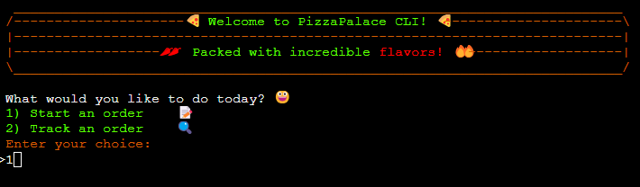

# PizzaPalace CLI

**Authors:** Tumelo Maja (GitHub username: tumelo-maja)

PizzaPalace is a command-line_interface (CLI) application for ordering pizza meals. User can choose their desired pizza and add additional toppings and dips. User are able to include drinks and sides in the meal order. 

**The application is aimed at helping users to:** 
  - Place an order for pizza meal in the command terminal
  - Modify their pizza order by adding extra toppings and dips
  - Add drinks and sides to their meal order
  - Track their placed order to know when/if their order is ready

**Target audience:** 
  - Individual looking to buy pizza
  - Event organisers/companies looking to place large order purchases of pizza for their events
  - 

**Application Mockup:** 

## Features 

### Existing Features
- **Main menu**
  <figure>
    
     
    <figcaption><strong><em>Main Menu</em></strong></figcaption>
  </figure>

  - **1)** - Start making an order.
  - **2)** - Start tracking an order.
  - **Enter your choice:** - Enter a value followed by enter

### Features Left to Implement

Future releases should use a proper database. Currently only order summaries are saved to the google sheet. The specific items are not saved i.e. google sheet has only number of drinks and not exactly which drink type e.g Orange Juice.

## Project planning
In this section, we provide all tasks related to project planning for development of the application. User stories and business goals are presented in this section

### Key business goals
Primary goal: Design an interactive, user-friendly and efficient pizza ordering application that gives a positive user experience to all users.

Other goals:
- Increase pizza order traffic
- Enhance user experience with intuitive application flow and informative feedback.
- Provide users with the option to customise their meal order by adding extras on the pizza and or sides and drinks 

### User stories

- **Interactive Welcome Message (must-have)**

  **Story:** 
    - As a user, I want to be welcomed by a user-friendly welcome message with clear and intuitive information about how to use the application.

  **Acceptance Criteria:**
    - On load, the application displays application name and welcome message.
    - The user is presented with two options 1) Place an order and 2) Track an order
    - User input is validated and any invalid entries are handle with an informative feedback and guide to resolve them

  **Tasks:**
    - Implement welcome display to run on launch of the application
    - Display two option with clear labels and corrensponding integer to enter for each option
    - Add code to validate user input and provide feeback for invalid entries while allowing user to resubmit the correct input

- **Add Pizza to Order (must-have)**

  **Story:** 
    - As a user, I want to see the available pizza options,prices, sizes and extras so I can choose and customize the pizza with my desired toppings.

  **Acceptance Criteria:**
    - Users can select pizza type using a integer input displayed besides each pizza option.
    - Users can choose pizza size from the 3 standard size options
    - Users have the option of adding extra toppings to their pizza,comma-separated integers - up to 8 toppings can be added.
    - Users have the option of adding extra dips to their pizza,comma-separated integers - up to 4 dips can be added.
    - User input is validated and any invalid entries are handle with an informative feedback and guide to resolve them

  **Tasks:**
    - Display pizza names and for each pizza, display base toppings included
    - After pizza name selection, display pizza sizes and cost for each option.
    - After pizza size selection, display optional extra topping avaibale to the user showing maximum amount allowed. 
    - After extra toppings selection, display optional extra dips avaibale to the user showing maximum amount allowed. 
    - Add code to validate user input and provide feeback for invalid entries while allowing user to resubmit the correct input

- **Submit Order to Google Sheets (must-have)**

  **Story:** 
    - As a user, I want to review and submit my order; view its summary and the time it will be ready by.

  **Acceptance Criteria:**
    - Order summary is displayed after all selections have been made
    - On confirmation, user can submit their order and receive success feeback and expected ready time.
    - Order summary is displayed including generated order number, counts of items ordered and total cost
    - User input is validated and any invalid entries are handle with an informative feedback and guide to resolve them

  **Tasks:**
    - Add code to connect to google sheets to add new order
    - Display order summary including ordered items, total costs and cacalculated ready by time
    - Display generated order number to be used for tracking the order. Prompt user return to home page. 
    - Add code to validate user input and provide feeback for invalid entries while allowing user to resubmit the correct input

- **Track Existing Order (must-have)**

  **Story:** 
    - As a user, I want to track my existing order using a unique order number so i can see its status.

  **Acceptance Criteria:**
    - Track order status can be accessed from main menu by selecting option 2
    - User is prompted to enter a valid order number.
    - If order exists, a full summary of the order is displayed including the order status otherwise user is informed if order number does not exist
    - User input is validated and any invalid entries are handle with an informative feedback and guide to resolve them

  **Tasks:**
    - Add code to refresh the google sheets to update order statuses
    - Add code to search for the valid order number from the google sheets records
    - Add code to display the order summary if order number exists in the records. Prompt user return to home page. 

- **Multiple Meals Order (should-have)**

  **Story:** 
    - As an event organizer, I want to add mutliple pizzas to order so I can place a full order for my group events.

  **Acceptance Criteria:**
    - After all meal selection and before submitting order, user is asked if they want to add another meal to the current order
    - User can specify pizza quantities for each meal item, up to 50 pizzas can be order per meal.
    - Final summary displays all pizzas with their individual selections of extras, drinks or sides
    - User input is validated and any invalid entries are handle with an informative feedback and guide to resolve them

  **Tasks:**
    - Implement code to allow user to add more meals to a single order
    - Implement code to allow user specify meal quantities for a specific meal before finlaizing the order item.
    - Using Order class, all meal items can be stored as a list with their individual selections
    - Add code to account for preparation time for large orders
    - Add code to validate user input and provide feeback for invalid entries while allowing user to resubmit the correct input

- **Add Meal Extras: Wings and Fries (should-have)**

  **Story:** 
    - As a user, I want to see the available sides and their prices so I can include them when I order the pizza should I choose to.

  **Acceptance Criteria:**
    - After completing pizza selection, display optional sides (wings/fries) available to the users to include in the meal order.
    - Users can choose different from sizes for the wings or fries sides,comma-separated integers - up to 6 sides can be added to the order.
    - User input is validated and any invalid entries are handle with an informative feedback and guide to resolve them

  **Tasks:**
    - Display a list of avaliable sides, their prices, sizes and corresponding integers to be used for selecting one or more sides.
    - Ensure that user's input does not exceed  the maximum number of sides allowed per meal.
    - Add code to validate user input and provide feeback for invalid entries while allowing user to resubmit the correct input

- **Add Drinks (should-have)**

  **Story:** 
    - As a user, I want to see the available drinks and their prices so I can include them when I order my meal.

  **Acceptance Criteria:**
    - After completing sides selection, display available optional drinks and their prices to the users to include in the meal order if they choose to.
    - Users can choose different drinks offer,comma-separated integers - up to 8 drinks can be added to the order.
    - User input is validated and any invalid entries are handle with an informative feedback and guide to resolve them

  **Tasks:**
    - Display a list of avaliable drinks, their prices, sizes and corresponding integers to be used for selecting one or more sides.
    - Ensure that user's input does not exceed  the maximum number of drinks allowed per meal.
    - Add code to validate user input and provide feeback for invalid entries while allowing user to resubmit the correct input

- **Modify Order Before Submitting (could-have)**

  **Story:** 
    - As a user, I want to modify my order before submitting it so I can replace menu items and add new ones if my preferences change.

  **Acceptance Criteria:**
    - User add more items or remove items for the current order.
    - Order summary and total costs are updated to reflect the changes
    - User input is validated and any invalid entries are handle with an informative feedback and guide to resolve them

  **Tasks:**
    - Display options for adding or removing items and the corresponding functions to handle either action.
    - Update the Orders list and the calculated total costs
    - Add code to validate user input and provide feeback for invalid entries while allowing user to resubmit the correct input

- **Style CLI with Emojis and Text Colors (could-have)**

  **Story:** 
    - As a user, I want the application to include colored text and emojis so the outlook feels more welcoming and easier to read important text

  **Acceptance Criteria:**
    - Where applicable, emojis are used to match the text and highlight important information
    - Colored text is used .e.g red color for errors and green for success
    - Styled text improves readability without distracting the user

  **Tasks:**
    - Implement text styling and coloring using relevant libraries
    - Implement emoji using unicode and where necessary 
    - Adjust text alignment to achieve consistency in text styling 

- **Anytime Application Exit (could-have)**

  **Story:** 
    - As a user, I want to abondon current order and return to main menu so I can start a new order without having to delete all individual order items

  **Acceptance Criteria:**
    - At every display, user can enter '99' to return to main menu
    - Order instance is reset and all previously added order items are cleared. 

  **Tasks:**
    - Add 'main menu' option to all inputs fields groups throughout the application
    - Warn user and seek confirmation to prevent accidental order deletion

### Flow charts

## Google Sheets API
This application uses google sheets as a cloud storage for placed orders. Google sheets and google drive APIs have been enabled for the application to have read and write permissions in the spreadsheet. A private API key is used to securely access the orders records and to update data in the sheet. 

<Image>

### Variables stored in Google sheets

- **Order ID**: A unique identifier based on the date and sequence number.
    
- **Order Date & Time**: Date timestamp when the order was placed.

- **Order Items**: Summary of pizzas, toppings, sides, drinks, and quantities.

- **Ready Time**: Calculated order completion time.

- **Status**: Indicates order status, the string can either be 'Preparing' or 'Ready'.

- **Total Cost**: Total amount for the order.

### Sheet updates and record retrivals
The application can add new records (as rows) to the 'orders' worksheet and also retrieve all records for tracking an existing order.

- **Sheet Updates:**
    - When an order is submitted from the application, a new row is added to the 'orders' worksheet.

    - The row includes all key order information: date, items, price, status, and readiness time in line with columns names in the worksheet.

- **Record Retrievals:**
    - When tracking an order, the application fetches all records and locates a specific order by checking the user's input order number against all existing entries in the 'order number' column of the worksheet.

    - The order statuses are updated based on the current time versus the scheduled ready time.

    - The updated summary of the queried order will be displayed in the application if it exists.

## Technologies

- **Python** - The application was developed using Python as the main language.
    - Packages used in the app include: gspread, google-auth, collections, datetime, pandas, os and two custom modules (pizza_meals and menu_items)
- **Google Sheets** - Orders records were stored on google sheets and an API with secure credentials was used access and modify the worksheet.

## Testing 

### Feature Testing

### Code validation

### Bugs

## Deployment

## Credits

Unicode for emojis - (https://apps.timwhitlock.info/emoji/tables/unicode)
Python program to print Emojis - (https://www.geeksforgeeks.org/python-program-to-print-emojis/)
colorrama - (https://www.geeksforgeeks.org/introduction-to-python-colorama/)
breaking lines python - (https://www.pythonmorsels.com/breaking-long-lines-code-python/)
ANSI escape codes - (https://jakob-bagterp.github.io/colorist-for-python/ansi-escape-codes/extended-256-colors/#structure)
clear console - (https://stackoverflow.com/questions/517970/how-can-i-clear-the-interpreter-console)

importing custom class in same directory - (https://stackoverflow.com/questions/4142151/how-to-import-the-class-within-the-same-directory-or-sub-directory)

import varaibles - (https://www.geeksforgeeks.org/how-to-import-variables-from-another-file-in-python/)

python docstrings - (https://www.datacamp.com/tutorial/docstrings-python)

### Tutorials and other resources

